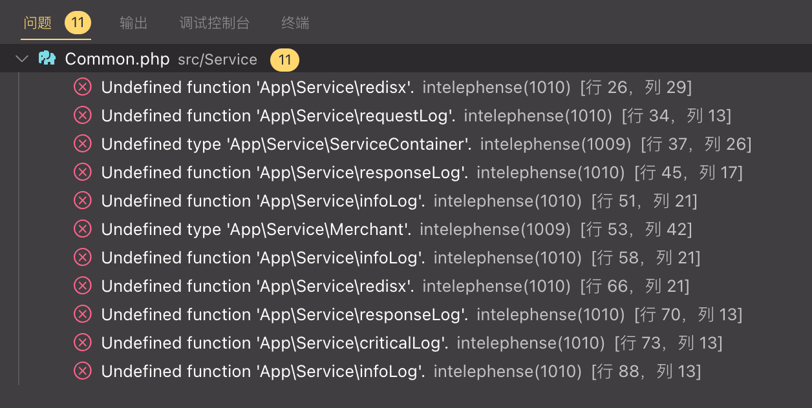

# 代码评审

> 章程 @ 2022.11.09

## geoHelperAddress

### 1. IDE 错误



或许是因为这不是一个完整的项目，有些公共方法或许没有被加载，但从这个 repo 来看，这些错误是肯定的。

### 2. Redis Key 不安全使用

```php
$cackeKey = 'cache-address-'.$address;
```

`$address` 变量有可能是中文长字符串，Redis Key 中不建议使用中文，并且长字符串可能会导致 Key 被截断。

正确方法：将 `$address` 进行 hash 运算，如：

```php
$cackeKey = 'cache-address-'.md5($address);
```

### 3. try { ... } 逻辑过长

`try / catch` 使用不合理，应当每一个有异常可能的方法单独 `if / try / catch / return`，根据执行逻辑做相应处理。如果整个逻辑不是需回滚的原子操作，`try` 中的逻辑应该尽量少。

### 4. 函数逻辑有漏洞

当没有缓存时，第一次访问了 `address = 北京, merchant_id = 1` 时，此时如果 merchant 是个上海的，这时**北京**的缓存种下的是**上海**的坐标，之后如果调用 `address = 北京` 时会一直返回**上海**坐标。

正确方法：

1. `getMerchantGEO($merchant_id)` 方法单独做缓存，查到写，查不到可以写空值或默认值
2. `getAddressGEO($address)` 方法单独缓存，查到写，查不到不写
3. `geoHelperAddress($address, $merchant_id = '')` 先调 `getAddressGEO`，如果有值就 `return`，否则就返回 `getMerchantGEO`

## checkStatusCallback

### 1. 返回值类型不明确

即返回 0/1，也返回 'xxxxx-y' 格式的字符串，但题目要求返回应该是 xxxxx-y 格式字符串

### 2. 如果返回值类型一定要混合，应当先建立状态码映射表，减少判断的时间复杂度

```php
// 伪代码
$statusMap = [
    // 可以回调
    '900' => 1,

    // 解锁工作单 但不回调
    '909' => 0,
    '915' => 0,
    '916' => 0,
];

if (array_key_exists($status, $statusMap)) {
    return $statusMap[status];
}
```

### 3. 911、999、12322 未定义的状态码，转换后的订单号可能不符合要求

`$status` 值应当验证，对预期之外值的给出一个默认处理方法

如果 `$status` 参数为 `null`、`-1`、`array`、`Object` 等情况会返回不符合预期的返回值

例如：`FD12345-`、报错 等。
